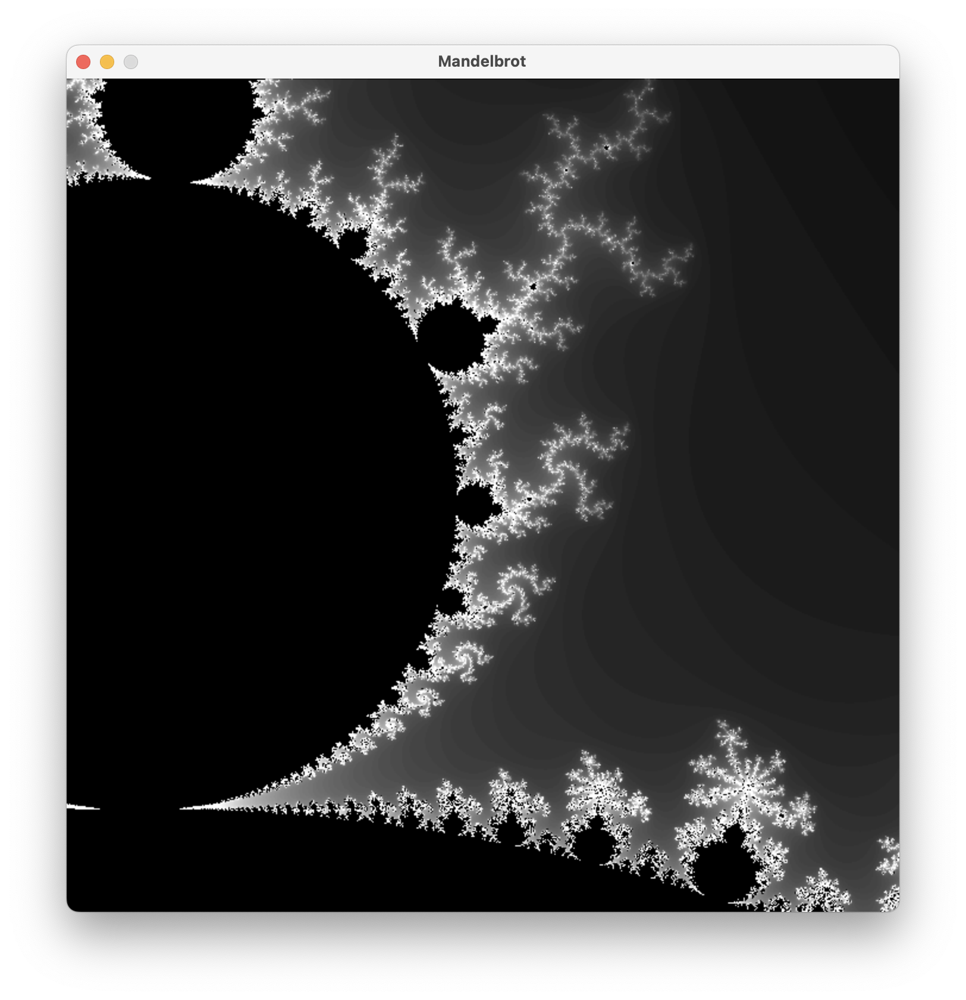
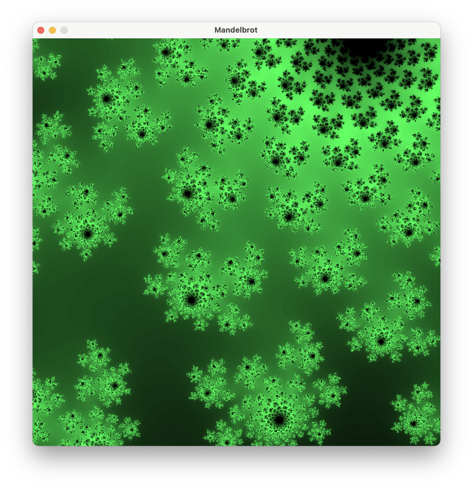
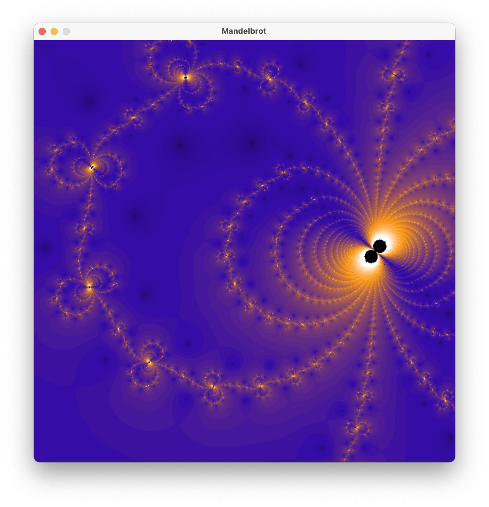

# Fractal Explorer

A mutli-threaded fractal explorer written in Rust-SDL. Fractals include Mandelbrot, Julia and Newton fractals. Zoom in as far as you like, the only limit is 64-bit float precision !

## Controls

* I : Zoom in (coarse)
* O : Zoom out (coarse)
* U : Upscale, increases iterations (coarse)
* P : Downscale (coarse)

* Z, Q, S, D : Movement
* T : Tweak, changes parameter for Julia and factor for Newton's method (by a factor of $e^{id\theta}$)

* \<Tab\> to switch fractals

* K : Zoom in (fine)
* J : Upscale (fine)

## Examples





## Instalation

```
cargo run --release
```

Note: debug mode is much to slow.

## Advanced Use


### Colorscale

As of now, changing the colorscale is done manualy buy changing the color vector in the default settings inside the code, src/main.rs line 204. Write the colors you want in order (RGB format), and the gradient will perform a linear interpolation between them.

### Newton fractals

Change the function used to plot Newton Fractals to any function with zeroes, direcly in the code default settings : src/main.rs default_f, default_fp line 207.
default_fp must be the derivative of default_f. 

